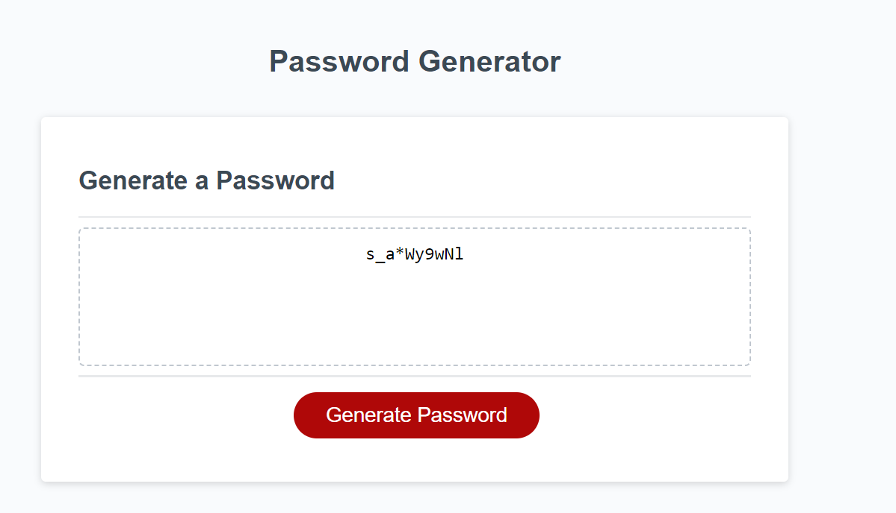

# 03 JavaScript: Password Generator

https://htranchung.github.io/JavaScript-Password-Generator-/

## Description

- Password random generator
- possibility of number
- possibility of lowercase
- possibility of uppercase
- possibility of special character

## Installation

N/A

## Usage

Generates a 8-128 character random password with prompts asking what do you want in your password. Number? Lowercase? Uppercase? Special Character?
ALL random
## Credits

N/A
